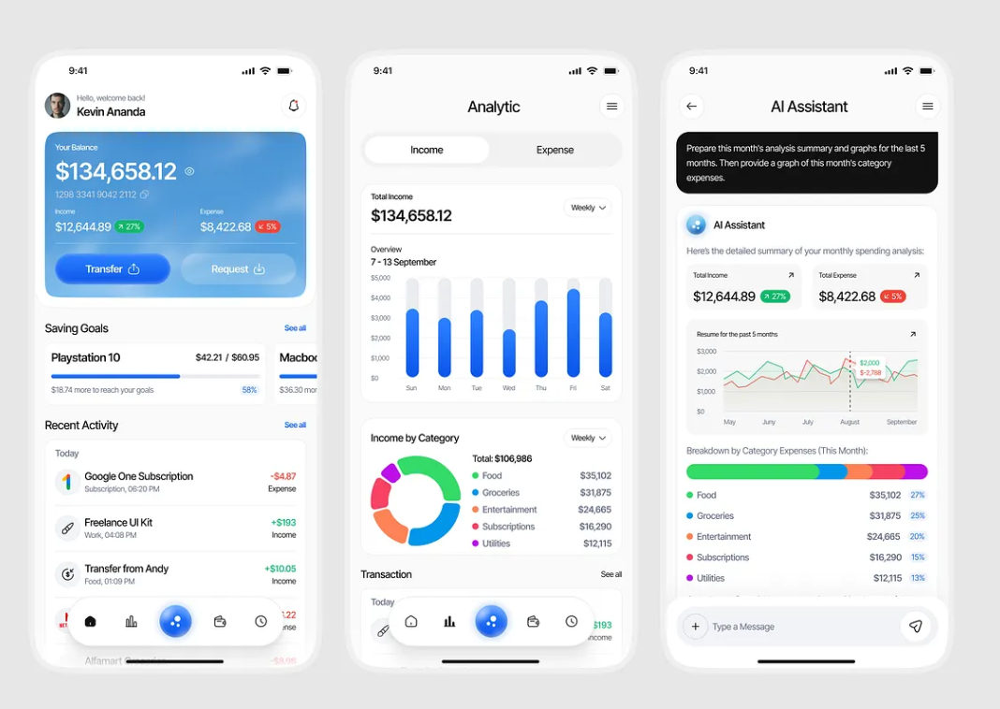

Here’s a polished, copy-paste-ready `README.md` you can drop straight into your repo. It assumes you’ll place the screenshot at `assets/finance-dashboard-mobile.png`.

```md
<p align="center">
  
</p>

# Real-Time Personal Finance Tracker

AI-powered, real-time personal finance assistant that turns raw transactions into answers, charts, and decisions. Built for **FrostHack 2025** under the problem statement by **Pathway & FetchAI**.

---

## Highlights

- **Live ingestion** with **Pathway** for streaming transactions and incremental indexing  
- **LLM agents** via **FetchAI** for natural-language queries and reasoning  
- **Actionable insights** like “Can I afford ₹5,000 today?” or “What did I spend on groceries last week?”  
- **Interactive charts** (day/week/month) and category breakdowns  
- **Web UI** with unified text + visual responses

---

## Tech Stack

**Backend**
- FetchAI autonomous agents (LLM-powered reasoning & tool use)
- Pathway vector store + stream processing
- Node.js + Express.js API

**Frontend**
- React (SPA), Vite
- Tailwind CSS
- Chart.js

**Dev/Infra**
- Docker (optional)
- GitHub Actions (CI/CD)
- Jest (tests)

---

## 🔎 Why this project

Most finance apps are batch-based and opaque. This project is **real-time, queryable, and explainable**:
- **Real-time**: new transactions are indexed immediately; charts update without rebuilds  
- **Queryable**: ask questions in natural language; the agent routes to data + tools  
- **Explainable**: responses include reasoning-grade text **and** data-backed visuals

---

## How it works

1. User asks a question (e.g., “What did I spend yesterday?”).  
2. Backend streams/ingests transactions into **Pathway**; embeddings are updated.  
3. **FetchAI** agent plans tools → retrieves facts → computes aggregates → prepares chart data.  
4. Frontend renders an answer + chart (category or time-series as appropriate).

---

## 📁 Project structure

```

Real-Time-Personal-Finance-Tracker/
├─ backend/
│  ├─ src/
│  │  ├─ index.ts            # Express bootstrap
│  │  ├─ agent/              # FetchAI agent orchestration
│  │  ├─ pathway/            # Pathway pipelines & vector store glue
│  │  └─ routes/             # /api/query, /api/ingest, etc.
│  ├─ tests/
│  └─ package.json
├─ frontend/
│  ├─ src/
│  │  ├─ App.tsx             # Query UI + chart panels
│  │  ├─ components/         # Charts, Cards, Inputs
│  │  └─ lib/                # API client, utils
│  └─ package.json
├─ assets/
│  └─ finance-dashboard-mobile.png
└─ README.md

````

---

## ⚙️ Setup

### Prerequisites
- Node.js **18+**
- (Optional) Docker Desktop

### 1) Clone

```bash
git clone https://github.com/PRABHMANNAT/Real-Time-Personal-Finance-Tracker.git
cd Real-Time-Personal-Finance-Tracker
````

### 2) Backend

```bash
cd backend
npm install
cp .env.example .env
npm run dev   # or: npm start
```

**Backend `.env` example**

```env
# FetchAI / LLM
FETCHAI_API_KEY=your_key_here

# Pathway / storage
PATHWAY_ENDPOINT=http://localhost:PORT
PATHWAY_PROJECT=rt-finance
PATHWAY_API_KEY=your_key_here

# Server
PORT=8080
NODE_ENV=development
```

### 3) Frontend

```bash
cd ../frontend
npm install
cp .env.example .env
npm run dev
```

**Frontend `.env` example**

```env
VITE_API_BASE_URL=http://localhost:8080
```

---

## 🔌 API shape

**Query**

```http
POST /api/query
Content-Type: application/json

{
  "question": "How much did I spend on groceries last week?"
}
```

**Response (example)**

```json
{
  "text": "You spent ₹3,245 on groceries last week across 4 transactions.",
  "chart": {
    "type": "bar",
    "labels": ["Mon","Tue","Wed","Thu","Fri","Sat","Sun"],
    "series": [0, 0, 1225, 0, 960, 0, 1060]
  }
}
```

**Ingest (mock/dev)**

```http
POST /api/ingest
{
  "transactions": [
    { "ts": "2025-09-27T10:01:00Z", "merchant": "Big Bazaar", "amount": 960, "category": "Groceries" }
  ]
}
```

---

## 🖥️ Scripts

**Backend**

```bash
npm run dev       # nodemon/dev server
npm run start     # prod server
npm run test      # unit/integration
```

**Frontend**

```bash
npm run dev       # vite dev server
npm run build     # production build
npm run preview   # preview build
```

---

## 🧭 Use cases

* “How much did I spend on **Food** this week?”
* “**Can I afford** a ₹5,000 purchase right now?”
* “Show me a **chart** of last month’s spending.”
* “What are my **recurring** subscriptions and their monthly total?”

---


## 🤝 Contributing

1. Fork the repo and create a feature branch.
2. Stick to conventional commits (e.g., `feat:`, `fix:`, `chore:`).
3. Add tests where it makes sense.
4. Open a pull request with a clear description and screenshots if UI changes.

---

## 📜 License

MIT — see `LICENSE`.

---

## 🙏 Acknowledgements

* **Pathway** for real-time pipelines & vector store
* **FetchAI** for autonomous agent tooling
* **FrostHack** organizers and mentors @IIT MANDI

---

## 📬 Contact

**Prabhmannat Singh**
Website: [https://prabh.site](https://prabh.site)
Email: [contact@prabh.site](mailto:contact@prabh.site)
LinkedIn: [https://linkedin.com/in/prabhmannat](https://linkedin.com/in/prabhmannat)

```

**Tip:** keep the image at `assets/finance-dashboard-mobile.png` and commit it first, so the README preview renders perfectly on GitHub.
```
